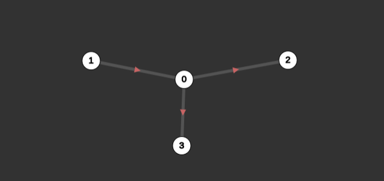

# nxtool
Tool for helping on the creation of small networks on the Python library [Networkx](https://networkx.org/).
You can use it in here: https://rodigu.github.io/nxtool/

Click on empty space to create a node

Click on a node and on another node to link them

Click on an existing node and then on blank space to create a node already linked to the first

Press 'u' to undo

